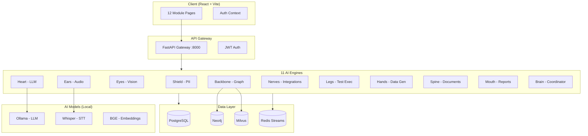

# NEXUS QA — AI Engine Factory for Enterprise Knowledge & Testing

> An actuary explains how an insurance product works.
> Nexus listens, remembers forever, explores the software, and tests everything.

[](https://www.typescriptlang.org/)
[](https://react.dev/)
[](https://python.org/)
[](https://fastapi.tiangolo.com/)
[](https://docs.docker.com/compose/)
[](.)

---

## Overview

Nexus QA is an **on-premise AI platform** that captures knowledge transfer sessions, extracts business rules, generates tests, detects contradictions, and provides full traceability — all powered by 10 specialized AI engines plus an intelligent Brain coordinator running locally on your infrastructure with **zero cloud dependencies**.

```
┌─────────────────────────────────────────────────────────────────────┐
│                       NEXUS AI ENGINE FACTORY                       │
│                                                                     │
│  🛡️ Shield   → PII detection & real-time redaction                  │
│  🎧 Ears     → Audio transcription, diarization & speaker ID       │
│  👁️ Eyes     → Screen capture, visual analysis & UI parsing        │
│  🧠 Heart    → Business rule extraction & test case generation     │
│  🦴 Backbone → Knowledge graph (Neo4j) + vector store (Milvus)     │
│  🔌 Nerves   → Jira, Slack, GitHub, Teams, Confluence connectors   │
│  🦿 Legs     → Multi-protocol test execution (Web, API, Mainframe) │
│  🤲 Hands    → Synthetic test data generation (boundary + fuzzing) │
│  📄 Spine    → Document ingestion (PDF, Excel, Word, PPT)          │
│  🗣️ Mouth    → Reports, traceability matrices & compliance docs    │
│  🧠 Brain    → Intelligent coordinator, quality gate & tier mgmt   │
│                                                                     │
│  Orchestrator: qa-orchestrator (session → rules → tests → defects) │
│  Client:       12-module React UI with dark-mode glassmorphism      │
└─────────────────────────────────────────────────────────────────────┘
```

---

## Architecture



---

## UI Modules (12 Pages)

The client is organized into **4 zones** with **12 interactive modules**:

### Zone 1 — Capture & Replay
| Module | Page | Description |
|--------|------|-------------|
| Session Command Center | `SessionCommandPage` | Live KT session management, audio upload, real-time transcription |
| Session Replay | `SessionReplayPage` | Timeline-based session replay with intelligence events |

### Zone 2 — Knowledge & Intelligence
| Module | Page | Description |
|--------|------|-------------|
| SME Knowledge Profiles | `SMEProfilesPage` | Expert tracking, bus factor analysis, knowledge risk alerts |
| Knowledge Graph Explorer | `KnowledgeGraphPage` | Interactive graph visualization with NL query support |
| Contradiction Radar | `ContradictionRadarPage` | Severity-ranked contradictions with SME resolution workflow |
| AI Confidence & Guardrails | `AIConfidencePage` | 4-stage guardrail pipeline, trust scoring, review queue |

### Zone 3 — Testing & Compliance
| Module | Page | Description |
|--------|------|-------------|
| Living Traceability Matrix | `TraceabilityMatrixPage` | Rule → Test → Defect traceability with coverage analysis |
| Test Execution Center | `TestExecutionCenterPage` | Multi-protocol test execution with auto-defect filing |
| Test Data Forge | `DataForgePage` | AI-driven synthetic data generation (boundary, fuzzing, load) |
| Compliance Cockpit | `ComplianceCockpitPage` | Multi-jurisdiction compliance tracking (TX, WA, NY, CA, FL) |

### Zone 4 — Executive & Admin
| Module | Page | Description |
|--------|------|-------------|
| Executive Insights | `ExecutiveInsightsPage` | KPIs, ROI dashboard, risk grade, engine status overview |
| System Administration | `AdminPage` | Engine management, integrations, users, audit trail |

---

## Quick Start

### Prerequisites

- **Docker** & **Docker Compose** v2+
- **Node.js** 18+ (for local client development)
- **Python** 3.11+ (for local engine development)
- **NVIDIA GPU** recommended for Ears/Eyes/Heart engines (Ollama, Whisper)

### 1. Production Deployment (Docker)

```bash
# Clone
git clone <repo-url> && cd nexus-qa

# Configure environment
cp .env.example .env
# Edit .env — set database passwords, JWT secret, Ollama model, etc.

# Launch all services (backend + client + AI models)
docker-compose up -d

# Verify
docker-compose ps

# Open UI
# http://localhost:3080  (Client — React frontend)
# http://localhost:8080  (API Gateway)
# http://localhost:11434 (Ollama)
```

### 2. Local Client Development

```bash
cd client

# Install dependencies
npm install

# Start dev server (proxies /api → localhost:8000)
npm run dev

# Open http://localhost:3000
# Demo credentials: admin@nexus.ai / admin123
```

### 3. Running Tests

```bash
cd client

# Run all tests
npm test

# Watch mode
npm run test:watch

# With coverage
npm run test:coverage
```

---

## Project Structure

```
nexus-qa/
├── client/                         # React UI (Vite + TypeScript + Tailwind)
│   ├── src/
│   │   ├── pages/                  # 12 module pages + Login/Register
│   │   │   ├── SessionCommandPage.tsx
│   │   │   ├── SessionReplayPage.tsx
│   │   │   ├── SMEProfilesPage.tsx
│   │   │   ├── KnowledgeGraphPage.tsx
│   │   │   ├── ContradictionRadarPage.tsx
│   │   │   ├── AIConfidencePage.tsx
│   │   │   ├── TraceabilityMatrixPage.tsx
│   │   │   ├── TestExecutionCenterPage.tsx
│   │   │   ├── DataForgePage.tsx
│   │   │   ├── ComplianceCockpitPage.tsx
│   │   │   ├── ExecutiveInsightsPage.tsx
│   │   │   ├── AdminPage.tsx
│   │   │   ├── LoginPage.tsx
│   │   │   ├── RegisterPage.tsx
│   │   │   └── __tests__/          # 13 test files (32 tests)
│   │   ├── components/             # Shared UI components (Sidebar, LiveBadge)
│   │   ├── contexts/               # AuthContext (JWT, tenant isolation)
│   │   ├── hooks/                  # useApiData (API-with-fallback pattern)
│   │   ├── services/               # API client (25+ endpoints)
│   │   └── test/                   # Test utilities & mocks
│   ├── vite.config.ts              # Vite + Vitest config
│   ├── tailwind.config.js          # Dark theme, custom colors
│   └── package.json
│
├── sdk/nexus-sdk/                  # Shared engine SDK & plugin framework
│
├── platform/                       # Core platform services
│   ├── gateway/                    # FastAPI API gateway (:8000)
│   ├── auth/                       # JWT authentication & RBAC
│   └── orchestrator/               # Platform-level orchestration
│
├── engines/                        # The 11 AI Engines
│   ├── shield-engine/              # 🛡️ PII detection & redaction
│   ├── ears-engine/                # 🎧 Audio → text (Whisper + Pyannote)
│   ├── eyes-engine/                # 👁️ Visual capture & UI parsing
│   ├── heart-engine/               # 🧠 Rule extraction & test generation
│   ├── backbone-engine/            # 🦴 Neo4j graph + Milvus vectors
│   ├── nerves-engine/              # 🔌 Jira, Slack, GitHub, Teams
│   ├── legs-engine/                # 🦿 Playwright, API, Py3270 execution
│   ├── hands-engine/               # 🤲 Synthetic data generation
│   ├── spine-engine/               # 📄 PDF/Excel/Word/PPT ingestion
│   └── mouth-engine/               # 🗣️ Reports & traceability matrices
│   └── brain-engine/               # 🧠 Intelligent coordinator & quality gate
│
├── products/
│   └── qa-orchestrator/            # QA product workflow orchestrator
│
├── infrastructure/
│   ├── docker/                     # Dockerfiles (base, gpu, client)
│   │   ├── Dockerfile.base         # Python base image
│   │   ├── Dockerfile.gpu          # NVIDIA CUDA image
│   │   ├── Dockerfile.client       # Multi-stage Node → nginx
│   │   └── nginx-client.conf       # SPA routing + API proxy
│   ├── helm/                       # Kubernetes Helm charts
│   ├── monitoring/                 # Prometheus + Grafana configs
│   └── scripts/                    # Deployment & migration scripts
│
├── tests/                          # Integration, E2E & load tests
├── alembic/                        # PostgreSQL migrations
├── docker-compose.yml              # Full stack (~25 services)
├── .env.example                    # Environment variable template
└── .github/                        # CI/CD workflows
```

---

## Tech Stack

### Frontend

| Component | Technology | Purpose |
|-----------|-----------|---------|
| Framework | React 18.3 | Component-based UI |
| Language | TypeScript 5.3 | Type-safe development |
| Bundler | Vite 5.1 | Fast HMR & production builds |
| Styling | Tailwind CSS 3.4 | Utility-first dark theme |
| Routing | React Router 6 | SPA navigation |
| Testing | Vitest + Testing Library | Unit & component tests |
| Icons | Lucide React | Consistent icon system |

### Backend

| Component | Technology | Purpose |
|-----------|-----------|---------|
| Language | Python 3.11+ | Engine & platform code |
| API | FastAPI | High-perf async REST endpoints |
| Auth | JWT + bcrypt | Stateless authentication |
| Database | PostgreSQL 16 | Persistent data store |
| Graph DB | Neo4j | Knowledge graph relationships |
| Vector DB | Milvus | Semantic search embeddings |
| Message Bus | Redis Streams | Inter-engine communication |
| Migrations | Alembic | Schema versioning |

### AI Models (All Local)

| Component | Technology | Purpose |
|-----------|-----------|---------|
| LLM | Ollama (Llama 3.1 70B) | Rule extraction, test generation |
| PII Detection | Phi-3 3.8B | Privacy-safe data processing |
| Speech-to-Text | Whisper v3 Large | Audio transcription |
| Speaker ID | Pyannote 3.1 | Speaker diarization |
| Vision | Qwen-VL / CogVLM2 | Screen capture analysis |
| Embeddings | BGE-Large-EN v1.5 | Semantic similarity (CPU) |

### Infrastructure

| Component | Technology | Purpose |
|-----------|-----------|---------|
| Containers | Docker + Compose | Service orchestration |
| Reverse Proxy | nginx 1.27 | Client serving & API proxy |
| Monitoring | Prometheus + Grafana | Metrics & alerting |
| CI/CD | GitHub Actions | Automated testing & deployment |
| GPU Support | NVIDIA Container Toolkit | CUDA acceleration |

---

## API Endpoints

The API gateway exposes these endpoint groups (all prefixed with `/api`):

| Group | Endpoints | Description |
|-------|-----------|-------------|
| Auth | `POST /auth/login`, `POST /auth/register` | JWT authentication |
| Sessions | `GET /sessions`, `GET /sessions/:id/events` | KT session management |
| SME | `GET /sme/profiles` | Expert profile tracking |
| Knowledge | `GET /knowledge/search` | Graph & vector search |
| Contradictions | `GET /contradictions`, `POST /contradictions/:id/resolve` | Conflict detection |
| Guardrails | `GET /guardrails/pipeline`, `GET /guardrails/review-queue` | AI confidence scoring |
| Traceability | `GET /traceability/traces` | Rule → test → defect mapping |
| Tests | `GET /tests/suites`, `GET /tests/runs` | Test execution management |
| Data Forge | `GET /data-forge/configs`, `GET /data-forge/results` | Synthetic data generation |
| Compliance | `GET /compliance/jurisdictions` | Regulatory compliance tracking |
| Insights | `GET /insights/kpis`, `GET /insights/engine-status` | Executive dashboards |
| Admin | `GET /admin/engines`, `GET /admin/audit-log` | System administration |

---

## Environment Variables

Key configuration variables (see `.env.example` for the full list):

```bash
# Database
POSTGRES_HOST=postgres
POSTGRES_PORT=5432
POSTGRES_DB=nexus_qa
POSTGRES_USER=nexus
POSTGRES_PASSWORD=changeme

# Auth
JWT_SECRET=your-256-bit-secret
JWT_ALGORITHM=HS256

# AI Models
OLLAMA_BASE_URL=http://ollama:11434
EYES_OLLAMA_MODEL=llava:7b
HEART_OLLAMA_MODEL=llama3.2:1b
HEART_TIER3_MODEL=llama3.2:1b
BRAIN_OLLAMA_MODEL=llama3.2:1b
BRAIN_TIER3_MODEL=llama3.2:1b

# Client
CLIENT_PORT=8080
VITE_API_BASE=http://localhost:8000

# Services
REDIS_URL=redis://redis:6379
NEO4J_URI=bolt://neo4j:7687
MILVUS_HOST=milvus
```

---

## Design System

The UI uses a **dark-only theme** with glassmorphism effects:

- **Background**: `bg-gray-950` with subtle grid overlay
- **Cards**: `bg-white/[0.04]` with `backdrop-blur` and `ring-white/[0.06]` borders
- **Primary gradient**: `from-nexus-500 to-purple-600` (custom teal-violet)
- **Stat cards**: Glassmorphic with colored accent gradients per engine
- **Typography**: System font stack with monospace for data values
- **Animations**: `animate-fade-in`, gradient pulse, subtle hover transitions

---

## Development

### Client Commands

```bash
cd client
npm run dev          # Dev server with HMR (:3000)
npm run build        # Production build → dist/
npm test             # Run all 32 tests
npm run test:watch   # Watch mode
npm run test:coverage # With coverage report
npx tsc --noEmit     # TypeScript check
```

### Docker Commands

```bash
docker-compose up -d                    # Start all services
docker-compose up -d client gateway     # Start specific services
docker-compose logs -f client           # Follow client logs
docker-compose down                     # Stop all services
docker-compose down -v                  # Stop and remove volumes
```

---

## License

Proprietary — All Rights Reserved
